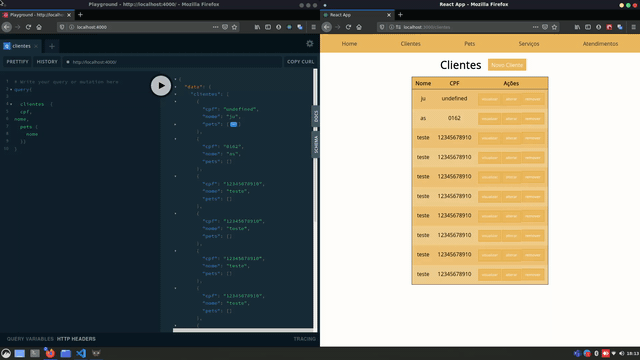
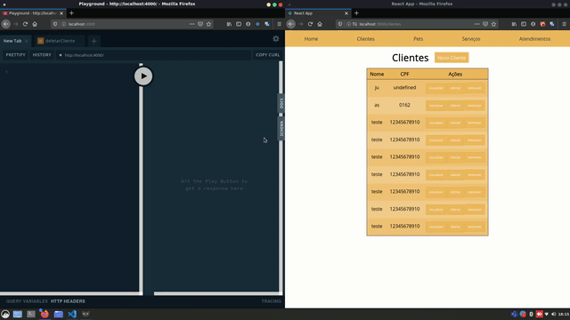

# course-graphQL-alura

Course Alura GraphQL - Convert Node API REST to Node API GraphQL and integrated with SPA React using Apollo Client

- [Course 01 - Hello World](https://www.alura.com.br/curso-online-graphql)
- [Course 02 - Change REST to GraphQL](https://www.alura.com.br/curso-online-graphql-parte-dois)
- [Course 03 - Join Front Apollo Client](https://www.alura.com.br/curso-online-graphql-integrando-com-front-end)

## Utilizando Playground

### Continuar, incompleto

- trocar cliente api rest front: clientes, servicos, atendimentos.
- continuar api graphql rest pet.

- trocar api rest por graphql back: servicos e atendimentos

